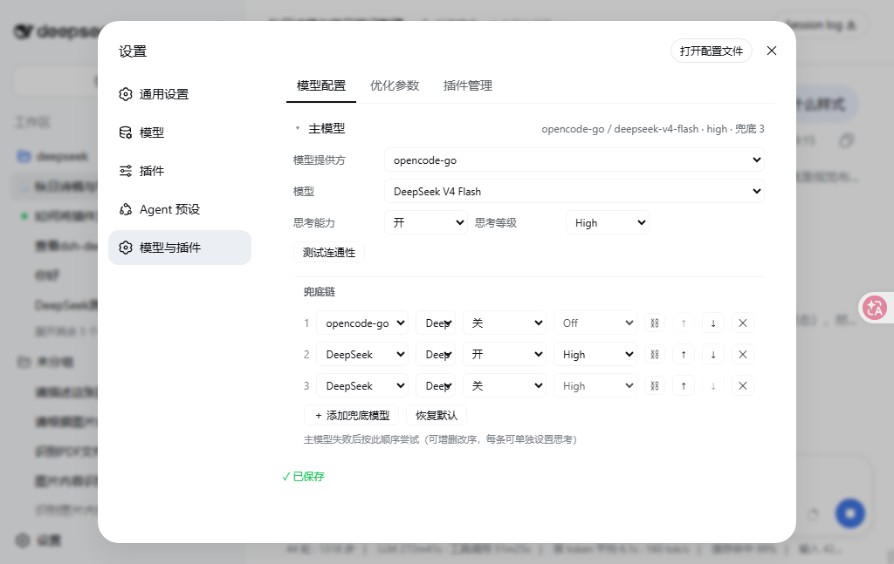

# dsh-prompt-enhancer

A prompt-enhancement plugin for [DeepSeek Harness](https://github.com/deepseek-ai/deepseek-harness) (DSH): type a rough prompt, click ✨, and an independent LLM call rewrites it into a stronger prompt — directly in the composer, fully undoable.

[](https://github.com/Fishsb/dsh-prompt-enhancer/releases)
[](https://github.com/Fishsb/dsh-prompt-enhancer/releases)
[](LICENSE)
[](https://github.com/Fishsb/dsh-prompt-enhancer)

## Features

- ✨ **One-click enhance** — an independent LLM call replaces the draft in place
- ↩️ **Undo anytime** — restore the original with one click; manually editing the draft exits undo (undo also clears the previous memory pair)
- ⏹️ **True cancel** — click during enhancement aborts and restores the draft
- 🛡️ **Guards** — empty input / slash commands / submitting states are handled; `/cmd body` optimizes only the body, keeping the prefix
- 🌐 **i18n** — follows the DSH interface language (中文 / English)
- 🎛️ **4 optimization modes** — Basic (direct, fastest) / Lite (local rules) / Standard (rules + workspace & session retrieval) / Smart (LLM task-progress analysis + full retrieval)
- 🧠 **Independent memory switch** — when on, the previous optimization pair is injected into the next round; when off, nothing is read or written; cleared on undo
- 📊 **Live progress** — the button shows the current stage while optimizing (Preparing… → Optimizing…), hover switches to a red "Cancel", constant width with no flicker
- 📏 **Visual parity** — button font (DengXian) / weight / pill shape / gray label / darker hover ellipse match the DSH model selector
- 🚀 **Version check & one-click update** — built-in updater detects new versions and pulls the release files ([Releases](https://github.com/Fishsb/dsh-prompt-enhancer/releases))
- 🧪 **Unit-tested** — host pure-function tests (node:test) slice the PURE section, so tests run the shipped code

## Screenshots



## Install

### Option 1: bundle one-click install (recommended)

```sh
dsh plugin --profile web add github:Fishsb/dsh-prompt-enhancer
```

Restart DSH (`dsh web`) after installing — the ✨ button appears in the composer toolbar. Update / remove:

```sh
dsh plugin --profile web update dsh-prompt-enhancer
dsh plugin --profile web remove dsh-prompt-enhancer
```

### Option 2: dynamic Cordis install

In a DSH session, ask the agent to read `plugin-host.js` (host half) and `plugin-client.js` (client half) from this repo, define the plugin with `cordis_define` (`plugin.kind: 'new'`), then `cordis_run` (mode: `run`). The first client-half run requires browser approval.

> Note: the dynamic client half is attached to the page connection active at activation time; a page refresh unloads it — just `cordis_run` again to restore.

### Quick-install snippet (paste into any DSH session)

```
Install the dsh-prompt-enhancer plugin for me:
1. Read plugin-host.js and plugin-client.js from https://github.com/Fishsb/dsh-prompt-enhancer
2. Define it with cordis_define: code.host = plugin-host.js, code.client = plugin-client.js, plugin.kind = new
3. cordis_run the returned pluginId/packageId (mode: run)
4. Wait for me to approve in the browser
```

## Usage

1. Type any non-empty, non-slash-command text
2. Click the **✨** button (or press Enter while focused)
3. Wait for the independent LLM call; the draft is replaced with the enhanced version
4. Not satisfied? Click **✓ Optimized · Undo** to restore the original

## Configuration

Settings → "Models & plugins" → "Optimization" tab:

| Setting | Description |
|---|---|
| Optimization mode | Basic (default, direct) / Lite / Standard / Smart; switching takes effect immediately and persists |
| Memory | On / Off; when on, the next round receives the previous optimization pair (first run falls back to Lite); when off, nothing is read or written |
| Context budget | 0 / 2000 / 4000 / 8000 chars; 0 = no context injection (memory block is budget-constrained too) |
| Timeout / Max tokens / Output limit | Request parameters |
| Template | Built-in / custom template text |

The model chain lives in the "Models" tab: tried in order, reorderable, per-entry thinking toggle & level, inline connectivity test, restore defaults.

## Changelog

Per-version release notes live on [GitHub Releases](https://github.com/Fishsb/dsh-prompt-enhancer/releases); the full history is in [CHANGELOG.md](CHANGELOG.md).

## Privacy

- **Mode context**: on demand, injects "recent session messages + relevant workspace file snippets + related session fragments", bounded by the budget; sensitive files (.env / keys / credentials / logs, etc.) are hard-filtered and never injected
- **Memory**: only a boolean seen-marker lives in browser localStorage (no content); the memory pair lives only in the current page's memory; turning the switch off stops all reads/writes
- The plugin itself records or reports nothing; diagnostics logs contain only metadata (mode, latency, etc.)
- Enhanced results come from an external LLM — verify before sending; after cancellation the underlying request may still run briefly on the provider side

## Compatibility

- Depends on DSH runtime-injected APIs (`llm` / `slots` / `harness` / `inputActions` / `sessionQuery` / `fs`), which may change across DSH releases
- **Version check & one-click update**: the browser talks to `api.github.com` directly (CORS-enabled; the host needs no outbound network). Restricted networks must let the browser reach GitHub (proxy etc.)
- **Built-in fallback model chain**: points at the official DeepSeek provider (`deepseek-official`); using it requires a DeepSeek API key. Without one, configure a model chain under "Models & plugins" — a fresh install inherits the current model automatically, so manual setup is usually unnecessary
- Use a recent DeepSeek Harness

## License

[MIT](LICENSE)
