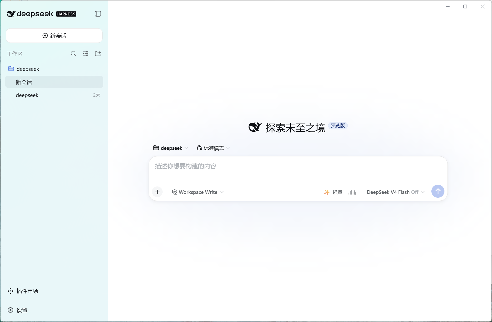
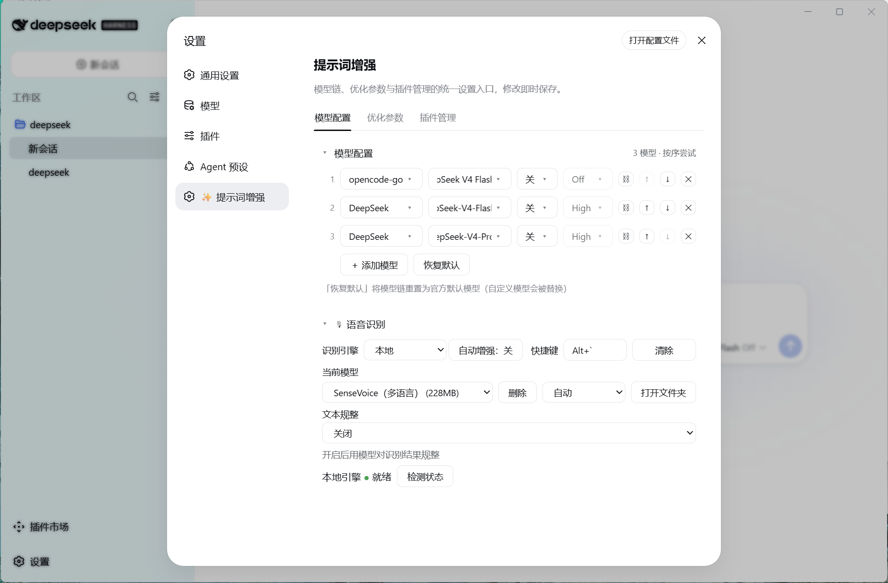

# dsh-prompt-enhancer

A DeepSeek Harness (DSH) plugin with **two core capabilities**:

- ✨ **Prompt enhancement** — rewrite composer drafts in place with one click, fully undoable
- 💬 **Voice recognition** — speech-to-text that stops on silence, with cloud / local dual engines; the transcript is filled into the draft

[](https://github.com/Fishsb/dsh-prompt-enhancer/releases)
[](https://github.com/Fishsb/dsh-prompt-enhancer/releases)
[](https://github.com/Fishsb/dsh-prompt-enhancer/stargazers)

## ✨ Two core features

### 1. Prompt enhancement (✨)

The ✨ button in the composer toolbar triggers an independent LLM call and rewrites the current draft in place; keep refining, undo anytime, or cancel while enhancing.

- **One-click enhance** — the ✨ button triggers an independent LLM call and replaces the draft; continue refining, undo anytime, cancel while enhancing
- **5 optimization modes** — Basic (direct) / Lite (previous-round context) / Standard (rules + retrieval) / Expert (task analysis + full retrieval) / One-click Publish (complete dev-spec generator)
- **Memory switch** — when on, pre-send rounds (optimize → edit → re-optimize) accumulate into a memory chain the next round replays and senses your edit direction; sending the message clears it; when off, nothing is read or written
- **Model chain** — try multiple models in order, reorder, toggle thinking, run inline connectivity tests

### 2. Voice recognition (💬)

The 🎤 record button beside the composer starts listening; the transcript (cloud Qwen3-ASR / local offline SenseVoice dual engines) → optional refinement (de-filler) → filled into the draft → can be enhanced with one click. **Stops automatically on silence** (VAD), audio stays in memory only and is never written to disk.

- **Dual engines** — cloud Qwen3-ASR / local offline SenseVoice (framework + optional download, slim release)
- **Stops on silence** — VAD silence detection, no manual stop needed (auto-stops after at most 60 seconds)
- **Hotkey wake** — recordable global hotkey, tap / long-press dual trigger
- **Transcript refinement** — optionally refine the transcript through the base LLM to remove filler words
- **Auto-enhance** — when on, filling the draft after recognition automatically triggers prompt enhancement

## 🔧 Other capabilities

- 🌐 **i18n** — follows the DSH interface language (中文 / English)

## 🚀 Install

```sh
dsh plugin --profile web add github:Fishsb/dsh-prompt-enhancer#main
```

Restart DSH (`dsh web`) after installing — the ✨ button appears in the composer toolbar.

> ⚠️ **Version note**: the latest tag `v3.3.3` (2026-09-01) **predates** the ✨ official slot-contract fix (Issue #8, commit `0197ae7`, not yet tagged) — with `#v3.3.3` the ✨ button does not render (only 🎤 works). The command above therefore installs `#main`; once the next release is tagged, replace `#main` with that tag.
>
> Requires [DeepSeek Harness](https://github.com/deepseek-ai/deepseek-harness) installed locally and `pnpm` in PATH.
>
> **Client compatibility (voice recognition)**: 🎤 voice input relies on the client injecting `inputActions.setDraft` (the official web client satisfies this); third-party clients implementing the same contract can load it, and when the capability set differs, voice input **degrades gracefully** (no insert capability → transcript appended to the end of the draft; no injection at all → 🎤 disabled with a notice). The **local offline engine uses a "framework + optional download" model**: the plugin ships **without** and does **not** auto-download models; go to Settings → Model configuration → 💬 Voice recognition → set engine to "Local" → in the "Local model" area click **Download model** (SenseVoice 228MB, with progress), and it takes effect automatically when done. See [compatibility notes](docs/compatibility-matrix.md) (client dependency boundary and slot contract).
>
> **Composer toolbar (✨/🎤) client contract**: the composer buttons and the error strip mount on the session-scoped slots `conversation.input.right` / `conversation.input.dock`. The official renderer (`@deepseek-ai/dsh-client-ui-renderer` ≥ 0.1.2-rc.1; web and DSH Desktop share the same source) injects **a `sessionId` prop, `useSession`/`useInput` selector hooks, and an `inputActions` prop** into slot entries (it never provides `props.session` / `props.input`); the plugin reads state through that contract since that fix (Issue #8, commit `0197ae7`, included in `#main`, not yet tagged) and keeps a fallback for older hosts that provide the `props.session` / `props.input` shape. Third-party client renderers must implement the same contract (`sessionId` plus the hooks and actions above) for ✨/🎤 to render.

Update / remove:

```sh
dsh plugin --profile web update dsh-prompt-enhancer
dsh plugin --profile web remove dsh-prompt-enhancer
```

> After `remove`, restart DSH to fully unload the running instance.
>
> After an update is installed, restart DSH manually for it to take effect (the plugin no longer restarts DSH for you).

## 📦 Library notes

Core logic lives in standalone Node modules, reusable from other scripts: `lib/updater-host.cjs` (update executor: download / verify / install / rollback), `lib/platform-service.cjs` (cross-platform service management), `lib/sys.cjs` (env & paths). See each module's header comments.

## 🎯 Usage (prompt enhancement)

1. Type any non-empty text (slash commands keep their prefix; only the body is optimized)
2. Click the **✨** button
3. Wait for the independent LLM call; the draft is replaced with the enhanced version
4. Not satisfied? Click **Undo** to restore the original

## 📸 See it work

**Voice recognition** (the 🎤 record button, stops on silence):



**Voice recognition settings** (engine switch / hotkey wake / model download / refinement):



## ⚙️ Configuration

Settings → "Models & plugins":

| Tab | Description |
|---|---|
| **Model configuration** | Configure the optimization model chain: tried in order, reorderable; the **Voice recognition** section (engine switch / hotkey wake / local model download / refinement) |
| **Optimization parameters** | Mode / memory switch / context budget / timeout & output limits / templates |

## 📚 Docs

- [Releases](https://github.com/Fishsb/dsh-prompt-enhancer/releases)
- [CHANGELOG](CHANGELOG.md)
- [Compatibility notes](docs/compatibility-matrix.md)

> Privacy: the plugin records or reports nothing; enhanced results come from an external LLM — verify before sending.

### 🌐 Downloading voice models on restricted networks

Local models are hosted on Hugging Face. If your network cannot reach it directly (common in mainland China):

1. **Use a local proxy**: keep your proxy client running (the system proxy switch can stay off); add the top-level field `"download": { "proxy": "http://127.0.0.1:10808" }` (or `socks5://…`) to the config file `%DSH_HOME%\dsh-prompt-enhancer.config.json`; after saving, click download again to go through the proxy;
2. **Place the files manually**: download the model files from [hf-mirror.com](https://hf-mirror.com) into `%DSH_HOME%\dsh-prompt-enhancer-asr\models\<model id>\` (sense-voice needs `model.int8.onnx` + `tokens.txt`); refresh the settings page and it is detected as installed;
3. Downloads have built-in **resume support and automatic multi-source switching** (HuggingFace ↔ hf-mirror), so an occasional interruption can simply be retried to resume.
