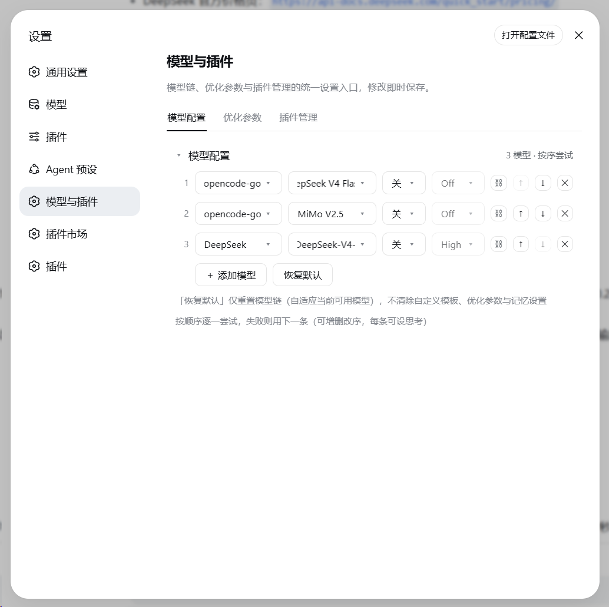
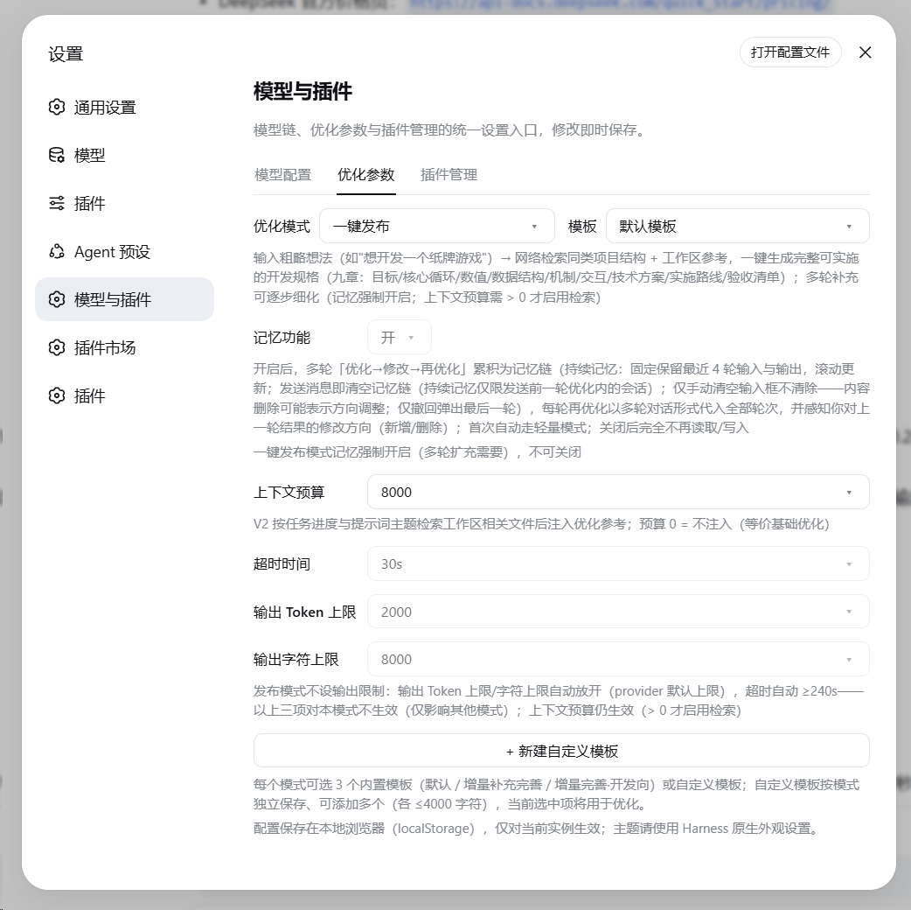

# dsh-prompt-enhancer

DeepSeek Harness (DSH) 提示词增强插件：输入框写草稿 → 点击 ✨ → 独立 LLM 调用一键改写 → 直接替换输入内容，不满意可撤回。

[](https://github.com/Fishsb/dsh-prompt-enhancer/releases)
[](https://github.com/Fishsb/dsh-prompt-enhancer/releases)
[](LICENSE)
[](https://github.com/Fishsb/dsh-prompt-enhancer)

## ✨ 功能亮点

- **一键增强**：输入框 ✨ 按钮触发独立 LLM 调用，直接替换草稿；可继续优化、一键撤回、增强中可取消
- **5 种优化模式**：基础（直发）/ 轻量（本地规则）/ 标准（规则 + 检索）/ 专家（任务分析 + 全量检索）/ 一键发布（生成完整开发规格）
- **记忆开关**：开启后多轮「优化→修改→再优化」累积为记忆链（最近 4 轮滚动保留），关闭后完全停止读写
- **模型链**：按序尝试多个模型，可增删改序、开关思考、行内连通性测试
- **多语言**：按钮与文案跟随 DSH 界面语言（中文 / English）

## 🚀 安装

```sh
dsh plugin --profile web add github:Fishsb/dsh-prompt-enhancer#v3.1.3
```

安装后重启 DSH（`dsh web`），输入框工具行出现 ✨ 按钮即安装成功。

> 需本机已装 [DeepSeek Harness](https://github.com/deepseek-ai/deepseek-harness) 且 `pnpm` 在 PATH 中。

更新 / 卸载：

```sh
dsh plugin --profile web update dsh-prompt-enhancer
dsh plugin --profile web remove dsh-prompt-enhancer
```

> 卸载后必须重启 DSH 才能从运行中移除。

## 🎯 使用

1. 输入任意非空文本（斜杠命令保留前缀，只优化正文）
2. 点击 **✨** 按钮
3. 等待独立 LLM 调用完成，草稿被替换为增强版本
4. 不满意点击 **可撤回** 恢复原文

## 📸 效果展示

| 模型配置 | 优化参数 |
|---|---|
|  |  |

## ⚙️ 配置

设置 →「模型与插件」：

| Tab | 说明 |
|---|---|
| **模型配置** | 配置优化模型链，按序尝试、可增删改序 |
| **优化参数** | 优化模式 / 记忆开关 / 上下文预算 / 超时与输出上限 / 模板 |

## 📚 文档

- [Releases](https://github.com/Fishsb/dsh-prompt-enhancer/releases)
- [CHANGELOG](CHANGELOG.md)
- [兼容性说明](docs/compatibility-matrix.md)

> 隐私：插件不记录、不上报任何数据；增强结果来自外部 LLM，发送前请自行核对。

## License

[MIT](LICENSE)
